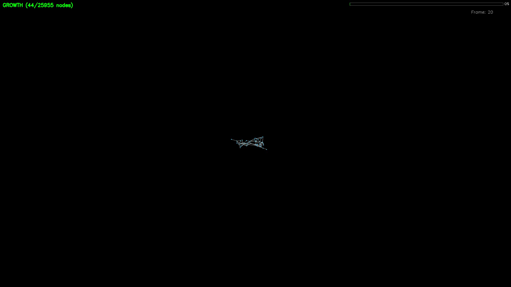
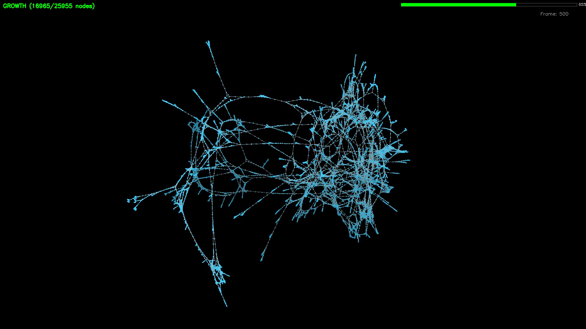
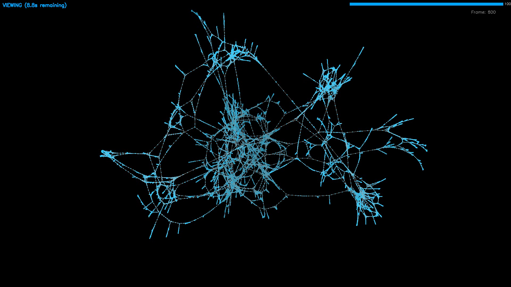

# Physics-Based 3D Graph Visualizer

一个基于 **Taichi Lang** GPU 加速的三维力导向图物理仿真与可视化系统。能够自动探索滑块谜题（如**华容道 Klotski**）的完整状态空间，并将演化过程渲染为具有物理特性的 3D 动态结构。

[](https://www.bilibili.com/video/BV1N1QTB4EZt)
[](https://www.youtube.com/watch?v=4orthiDjWME)
[](https://github.com/AStarySky/physics-based-3D-graph-visualizer)

> 灵感来源于 [twoswap - The 8 Elements of a Graph](https://www.youtube.com/watch?v=YGLNyHd2w10)

## Screenshots

| 生长初期 | 生长中期 | 生长完成 |
|:---:|:---:|:---:|
|  |  |  |

## Features

- **GPU 加速物理引擎**: 使用 Taichi Lang 编写高性能 kernel，在 GPU 上并行计算节点间的库仑斥力（O(N²/2) 对称更新）与弹簧引力
- **BFS 增量生长**: 从根节点开始逐步展开图结构，伴随物理松弛形成平滑动画
- **3D OpenGL 渲染器**: 自定义 GLSL 着色器管线，支持动态深度衰减与实时交互控制
- **PCA 主轴对齐**: 自动将相机对准点云的主成分方向，最大化信息展示
- **异步视频录制**: 基于 OpenCV 的后台帧写入，输出带信息叠加层的 MP4 视频
- **状态空间搜索**: 内置华容道引擎，支持任意矩形棋盘与移动约束的穷举枚举

## Tech Stack

| 组件 | 工具 |
|:---|:---|
| 物理引擎 | [Taichi Lang](https://www.taichi-lang.org/) (GPU Vulkan/CUDA) |
| 图形渲染 | OpenGL 3.3 Core Profile + PyOpenGL + GLFW |
| 数学计算 | NumPy, PyGLM, SciPy |
| 视频录制 | OpenCV (cv2) |
| 图算法 | NetworkX |

## File Structure

| 文件 | 说明 |
|:---|:---|
| `PlayGround.py` | 主入口，配置谜题参数并启动仿真与视频导出 |
| `GraphPhysics.py` | 物理引擎核心，包含 Taichi 斥力/引力 kernel 与 BFS 生长模拟 |
| `GraphRender.py` | OpenGL 渲染器：着色器、VAO/VBO 管理、相机控制（球坐标 + PCA 对齐） |
| `VideoRecorder.py` | 异步视频录制器，生产者-消费者模式，支持阶段切换与信息叠加 |
| `Klotski.py` | 华容道逻辑引擎：状态表示、邻居枚举、完整状态空间 BFS |
| `GraphHelper.py` | 图结构转换工具（边列表 ↔ 邻接矩阵 ↔ 邻接表） |

## Quick Start

### Install

```bash
pip install -r requirements.txt
```

### Run

```bash
python PlayGround.py
```

程序会枚举华容道状态空间，生成 BFS 生长动画视频 `Graph1.mp4`，然后进入交互式窗口。

### Interactive Mode

`PlayGround.py` 默认以 `visible=True` 运行，渲染完成后进入交互模式：

- **左键拖拽**: 旋转视角
- **滚轮**: 缩放
- **ESC**: 退出

### Force Re-render

如果视频已存在，默认跳过渲染。使用 `--force` 重新生成：

```bash
python PlayGround.py --force
```

## Physics Model

- **库仑斥力**: $F_{\text{rep}} = k^2 / r$ — 所有节点对之间
- **弹簧引力**: $F_{\text{att}} = r^2 / k$ — 边连接的节点之间
- **中心引力**: $F_{\text{grav}} = -k_{\text{grav}} \cdot \mathbf{p}$ — 防止漂移
- **阻尼**: $\mathbf{v}^{(t+1)} = \beta (\mathbf{v}^{(t)} + \mathbf{f} \cdot \Delta t)$, $\beta = 0.8$

平衡距离 $d_0 = k$ 使得相邻节点保持稳定间距，而非相邻节点被推远形成聚类分离。

## License

MIT
